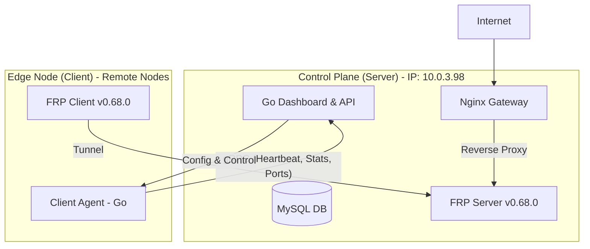

# FRP Centralized Management System (ProxyManager)

Hệ thống quản lý tập trung Fast Reverse Proxy (FRP) v0.68.0 hỗ trợ Client-Server architecture, tích hợp Dashboard điều khiển và tự động quét port trên Agent.

## 🏗 Architecture Design



## 🛠 Tech Stack
- **Backend/Dashboard:** Go (Gin/Echo), MySQL, gRPC.
- **Client Agent:** Go, gRPC, `gopsutil`.
- **Tunneling:** [FRP v0.68.0](https://github.com/fatedier/frp/releases/tag/v0.68.0).
- **Gateway:** Nginx.

## 🚀 Deployment Instructions

### 1. Trên Server (Node hiện tại - IP: 10.0.3.98)
Node này sẽ chạy các thành phần lõi của hệ thống.
- Cài đặt MySQL và tạo DB từ `internal/db/schema.sql`.
- Chỉnh sửa cấu hình trong `.env`.
- Build và chạy Server:
  ```bash
  make proto
  make build-server
  ./bin/server
  ```
- Chạy FRPS:
  ```bash
  make download-frp
  ./frps -c configs/frps.yaml
  ```

### 2. Trên Client Agent (Các node khác)
Node đích cần được quản lý sẽ chạy Client Agent.
- Cấu hình gRPC Server Address trỏ về: `10.0.3.98:50051`.
- Chạy Agent:
  ```bash
  ./bin/agent --server 10.0.3.98:50051
  ```

## 📋 Task List
Xem chi tiết nhiệm vụ của từng Agent tại [TASKS.md](TASKS.md).
