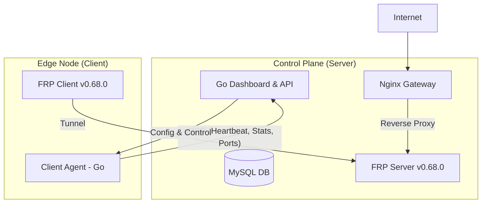

# FRP Centralized Management System (ProxyManager)

Hệ thống quản lý tập trung Fast Reverse Proxy (FRP) v0.68.0 hỗ trợ Client-Server architecture, tích hợp Dashboard điều khiển và tự động quét port trên Agent.

## 🏗 Architecture Design



## 🛠 Tech Stack
- **Backend/Dashboard:** Go (Gin/Echo), MySQL, gRPC.
- **Client Agent:** Go, gRPC, `gopsutil`.
- **Tunneling:** [FRP v0.68.0](https://github.com/fatedier/frp/releases/tag/v0.68.0).
- **Gateway:** Nginx.

## 🚀 Quick Start (Cho Agent/Developer)

1. **Pull code & Chuẩn bị môi trường:**
   ```bash
   git pull origin main
   make install-deps # Cài protoc, go (Ubuntu)
   ```

2. **Khởi tạo Database:**
   Sử dụng file `internal/db/schema.sql` để tạo database MySQL.

3. **Biên dịch gRPC:**
   ```bash
   make proto
   ```

4. **Tải FRP v0.68.0:**
   ```bash
   make download-frp
   ```

## 📋 Task List
Xem chi tiết nhiệm vụ của từng Agent tại [TASKS.md](TASKS.md).
